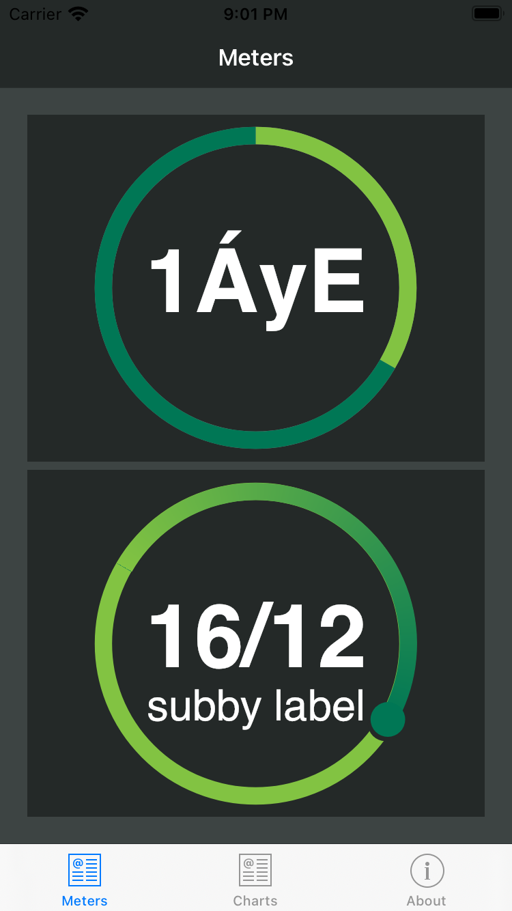
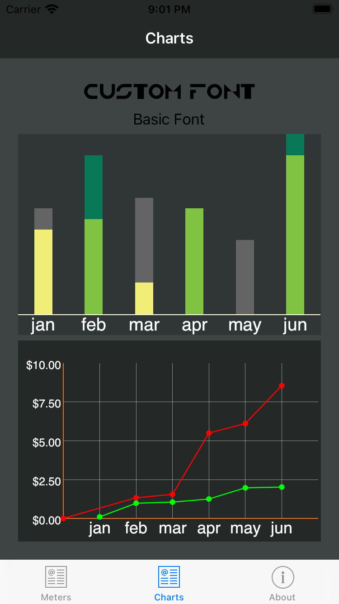

# Ray Charts

This is a demo app for some custom Xamarin Chart Controls which can be found in the nuget packages download section.

They include a:

* Progress Meter - the ring meter with 2 modes, percent complete and pie
* Progress Chart - a bar chart that overlays two bars on top of each other to show progress by period
* Multiline Chart - a typical line chart

The included app is to simply run the demo controls.

Documentation and more control customization parameters are forthcoming.

## Progress Ring
This is the ubiquitous progress ring or meter that can be used in 1 of 2 modes.

* Pie mode is really just a 2 data value pie chart that just displays as a ring - not filled in pie pieces.
* Progress mode is the chaser ring that continues to loop around even after reaching a target goal

## Charts

* Line Chart is just your typical multi-line series chart.
* Progress Bar Chart lets you specify 2 different values for each bar - a goal value and current value. The bars lay on top of each other and you can change their color to indicate if a goal is reached.

